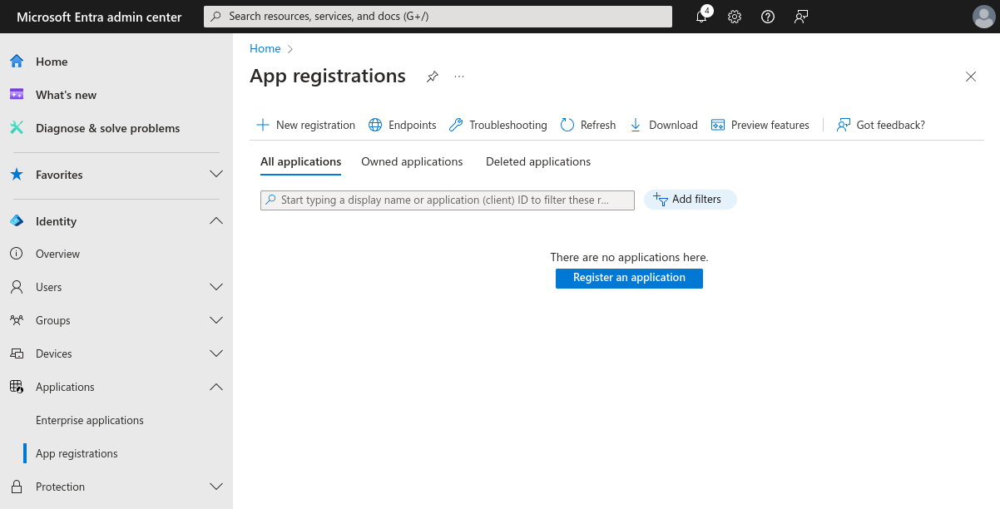
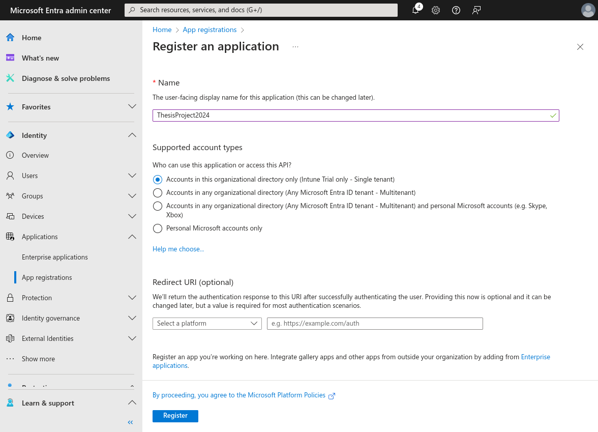
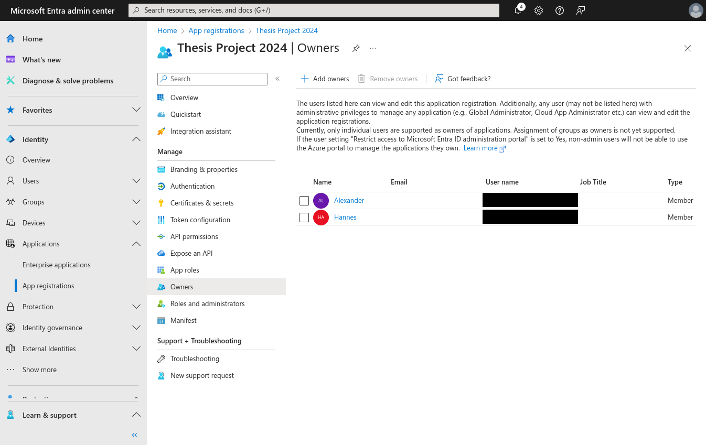
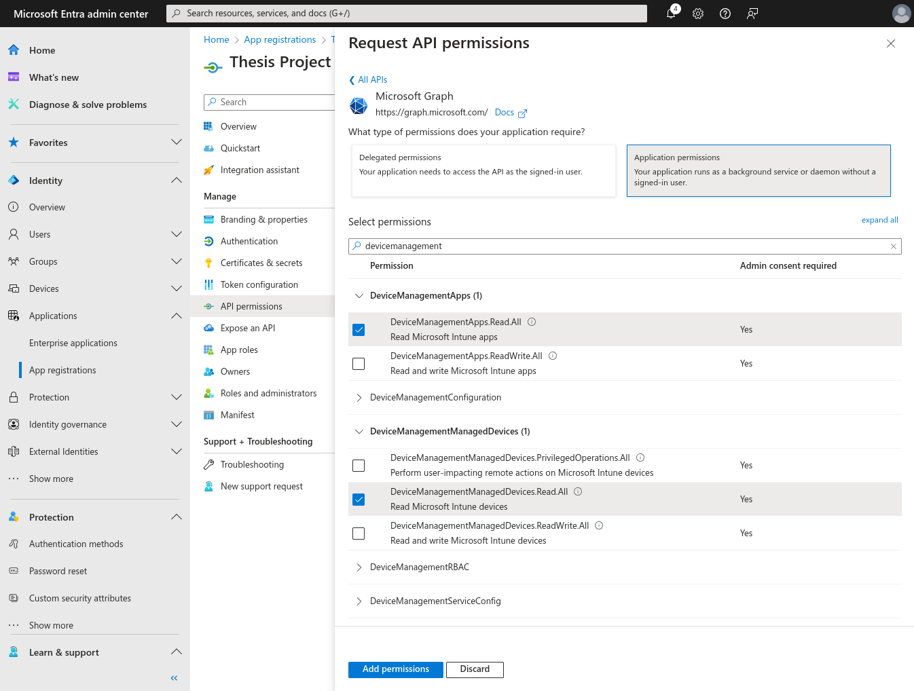
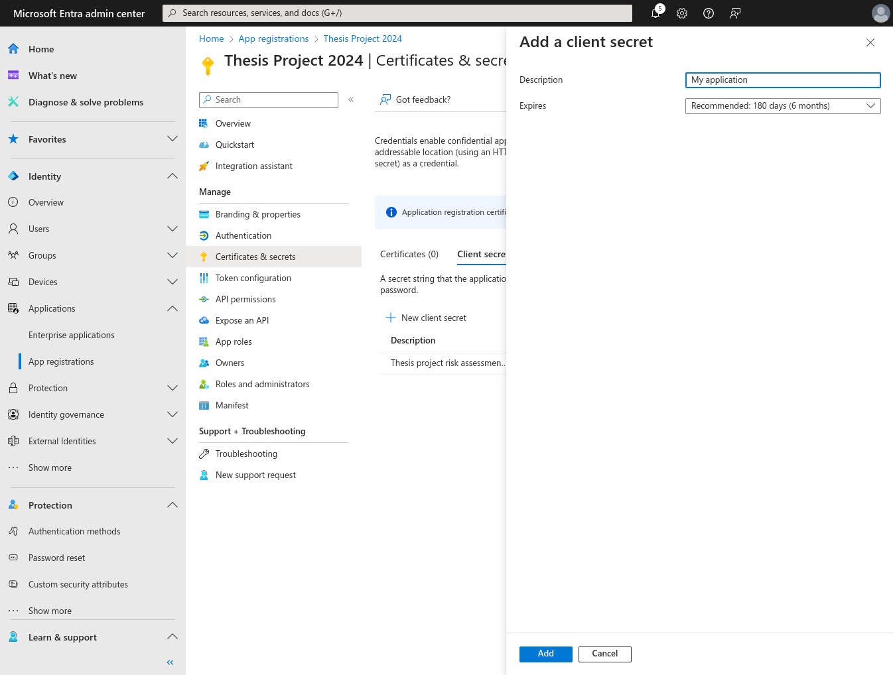

# Setting up a Microsoft Graph application for Intune

The server can use Microsoft Intune MDM as a data source. The list of devices will be fetched on a regular basis (by default, once a week) along with the list of discovered applications. Intune uses the Microsoft Graph developer platform which requires some manual work to get set up for a client application.

## Creating an application in Entra

Your server needs to be registered as a client application and this is done in Microsoft Entra. Go to [entra.microsoft.com](entra.microsoft.com) and select Identity > Applications > App registrations.

Choose "Register an application" and select a display name. No other options need to be changed.

Add your account as an owner to be able to edit permissions and generate client secrets.

## Granting the application permissions to Intune

The server needs the permission `DeviceManagementApps.Read.All` and `DeviceManagementManagedDevices.Read.All` to be able to read device and app lists from Microsoft Intune. Add these permissions in Manage > API permissions. Search for "Microsoft Graph" and select that your application is a background service without a signed-in user.

## Configuring client secrets

The server uses a client secret to identify itself. Microsoft also provides the option for the server to use a certificate, but a client secret suffices since our API keys should not be distributed to the public. Create a new secret by going to Manage > Certificates & secrets. Choose a name and an appropriate expiry time.

Entra should now give you the option to copy the secret and client ID (this can only be done ONCE). These should be added to `secrets.toml` under `api.msgraph`. The `authority` field also needs to be set manually depending on how your Intune instance is configured. For instances running on Azure, `login.microsoftonline.com` is the preferred domain and the tenant ID can be found in Identity > Overview.
